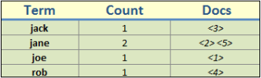

## 查询重写机制

<p>如果你曾经使用过很多不同的查询类型，比如前缀查询和通配符查询，从本质上上，任何的查询都可以视为对多个关键词的查询。可能用户听说过查询重写(query rewrite)，ElasticSearch(实际上是Apache Lucene很明显地)对用户的查询进行了重写，这样做是为了保证性能。整个重写过程是把从Lucene角度认为原始的、开销大的查询对象转变成一系列开销小的查询对象的一个过程。</p>
<h3 style="text-indent:0em;">以前缀查询为例</h3>
<p>展示查询重写内部运作机制的最好方法是通过一个例子，查看例子中用户输入的原查询语句中的term在内部被什么Term所取代。假定我们的索引中有如下的数据：</p>

```javascript
curl -XPUT 'localhost:9200/clients/client/1' -d
'{
"id":"1", "name":"Joe"
}'
curl -XPUT 'localhost:9200/clients/client/2' -d
'{
"id":"2", "name":"Jane"
}'
curl -XPUT 'localhost:9200/clients/client/3' -d
'{
"id":"3", "name":"Jack"
}'
curl -XPUT 'localhost:9200/clients/client/4' -d
'{
"id":"4", "name":"Rob"
}'
curl -XPUT 'localhost:9200/clients/client/5' -d
'{
"id":"5", "name":"Jannet"
}'
```


<!-- note structure -->
<div style="height:110px;width:90%;position:relative;">
<div style="width:13px;height:100%; background:black; position:absolute;padding:5px 0 5px 0;">

</div>
<div style="width:51px;height:100%;position:absolute; left:13px; text-align:center; font-size:0;">


</div>
<div id="mid" style="height:100%;position:absolute;left:65px;right:13px;">
<p style="font-size:13px;margin-top:10px;">
	所有购买了Packt出版的图书的读者都可以用自己的账户从http://www.packtpub.com. 下载源代码文件。如果读者通过其它的途径下载本书，则需要通过http://www.packtpub.com/support 来注册账号，然后网站会把源码通过e-mail发送到你的邮箱。
</p>
</div>
<div id="right" style="width:13px;height:100%;background:black;position:absolute;right:0px;padding:5px 0 5px 0;">

</div>
</div>  <!-- end of note structure -->

<br/>
<p>我们的目的是找到所有以字符 j 开头的文档。这个需求非常简单，在 client索引上运行如下的查询表达式：
</p>

```javascript
curl -XGET 'localhost:9200/clients/_search?pretty' -d '{
  "query" : {
    "prefix" : {
       "name" : "j",
       "rewrite" : "constant_score_boolean"
    }
  }
}'
```
<b>[勘误]</b>
需要注意的是，经验证，在elasticsearch 1.3.4版本中，该查询语法会出现解析错误。可以参考《ElasticSearch Server》一书以及es的源码QueryParseContext.parseInnerQuery()方法。
一本书难免会出现错误，如果读者能发现错误，则对书本内容的领悟自然更进一步。
正确的语法格式是：
```javascript
{
	"query":{
		"prefix":{
			"name":{
				"value":"j",
				"rewrite":"constant_score_boolean"
			}
		}
	}
}
```

<p>
我们用的是一个简单的前缀查询；前面说过我们的目的是找到符合以下条件的文档：name域中包含以字符 j 开头的Term。我们用rewrite参数来指定重写查询的方法，关于该参数的取值我们稍后讨论。运行前面的查询命令，我们得到的结果如下：</p>

```javascript
{
  ...
  "hits" : {
    "total" : 4,
    "max_score" : 1.0,
    "hits" : [ {
      "_index" : "clients",
      "_type" : "client",
      "_id" : "5",
      "_score" : 1.0, "_source" : {"id":"5", "name":"Jannet"}
    }, {
        "_index" : "clients",
        "_type" : "client",
        "_id" : "1",
        "_score" : 1.0, "_source" : {"id":"1", "name":"Joe"}
    }, {
        "_index" : "clients",
        "_type" : "client",
        "_id" : "2",
        "_score" : 1.0, "_source" : {"id":"2", "name":"Jane"}
    }, {
        "_index" : "clients",
        "_type" : "client",
        "_id" : "3",
        "_score" : 1.0, "_source" : {"id":"3", "name":"Jack"}
    } ]
  }
}
```

可以看到，在返回结果中，有4个文档的name域中的文本是以目标字符，即j开头。由于我们没有明确定义mappings，所以ElasticSearch会将name域自动识别字符串类型并进行分析。我们可以通过如下的命令验证这一点:
```javascript
curl -XGET 'localhost:9200/clients/client/_mapping?pretty'
```
执行命令，ElasticSearch会返回如下的结果：
```javascript
{
    "client" : {
        "properties" : {
            "id" : {
                "type" : "string"
            },
            "name" : {
                "type" : "string"
            }
        }
    }
}
```
###回到Apache Lucene

现在，让我们加到Apache Lucene的内部实现。如果你能回忆起Lucene倒排索引存储的内容，应该能想到倒排索引的每条记录保存着一个关键词，以及关键词的出现次数，以及对应文档的指针(如果没有回忆起来，请参考<b>第1章 认识ElasticSearch</b>的<b>认识Apache Lucene</b>一节的内容 )。对于我们clients索引来说，倒排索引的简化版如下：
<center></center>

在表格的关键词那一列中呈现的关键词是非常重要的。如果我们跟踪过ElasticSearch和Apache Lucene的源码，就可以看到prefix query重写成为如下的Lucene query:
```javascript
    ConstantScore(name:jack name:jane name:joe)
```
这意味着我们的前缀查询(prefix query)重写成了一个常量得分查询(constant score query)，即由3个term query组合而成的布尔查询(bool query)。即Lucene所做的就是列举索引中存在的以j为前缀的关键词，并且每个词都构建出一个query对象。如果将重写后的查询与没有重写的查询进行比较，可以看到使用重写后的查询会使系统的性能有所提升，特别是在不同关键词数量较多的索引中。

如果我们自己手工构建一个重写的查询，其结果可能如下所示(查询语句的内容已经保存在constant\_score\_query.json文件中)：
```javascript
{
    "query" : {
        "constant_score" : {
            "query" : {
                "bool" : {
                    "should" : [
                    {
                        "term" : {
                            "name" : "jack"
                        }
                    },
                    {
                        "term" : {
                            "name" : "jane"
                        }
                    },
                    {
                        "term" : {
                            "name" : "joe"
                        }
                    }
                    ]
                }
            }
        }
    }
}
```
接下来了解一下查询重写机制可以匹配的功能选项有哪些。

###查询重写的相关属性

前面已经提到rewrit参数可以用于任何多关键词查询(multiterm query，比如ElasticSearch中的prefix和wildcard查询)，通过该参数可以控制查询的重写方式。rewrite的用法是将rewrite参数放到query对象的JSON对象中，比如：
<pre>
{
    "query" : {
        "prefix" : {
            "name" : "j",
           <b> "rewrite" : "constant_score_boolean"</b>
        }
    }
}
</pre>

接下来，了解rewrite参数有哪些选项可用：

* `scoring_boolean`:该重写方法将对应的关键词转换成布尔查询的布尔Should子句，它有可能是CPU密集型的(因为每个关键词都需要计算得分)，而且如果关键词数量太多，则会超出布尔查询的限制，限制条件的上限是1024。与此同时，该类型的查询语句还保存计算的得分。布尔查询的默认数量限制可以通过修改elasticsearch.yml文件中的`index.query.bool.max_clause_count`属性值来修改。但始终要记住的是，产生的布尔查询子句越多，查询的性能越低。
* `constant_score_boolean`:该重写方法与上面提到的`scoring_boolean`重写方法类似，但是CPU消耗要低很多，因为它不计算得分，每个关键词的得分就是查询的权重，默认是1，也可以通过权重属性来设置其它的值。与`scoring_boolean`重写方法类似，该方法也受到布尔查询数量的限制。
* `constant_score_filter`:如Apache Lucene Javadocs中所述，该重写方法通过对前缀创建一个私有的过滤器，然后查询文档。(即把查询处理成过滤模式) 。对于匹配的文档，给定一个与查询权重一样的得分。该方法比`scoring_boolean`要快,特别是索引中匹配的文档或者与前缀匹配的关键词数量比较大时。
* `top_terms_N`:该重写方法将对应的关键词转换成布尔查询的布尔Should子句，同时保存计算得分。只是与`scoring_boolean`不同点在于，它只保留前N个关键词，来避免触发布尔子句数量的上限。
* `top_terms_boost_N`:该重写方法与`top_terms_N`类似，只是得分的计算只与权重有关，与查询词无关。

<!-- note structure -->
<div style="height:70px;width:90%;position:relative;">
<div style="width:13px;height:100%; background:black; position:absolute;padding:5px 0 5px 0;">

</div>
<div style="width:51px;height:100%;position:absolute; left:13px; text-align:center; font-size:0;">


</div>
<div id="mid" style="height:100%;position:absolute;left:65px;right:13px;">
<p style="font-size:13px;margin-top:10px;">
	当rewrite属性值设置为`constant_score_auto`或者不设置该属性时，`constant_score_filter`或者`constant_score_boolean`就会作为默认值，究竟选择哪个取决于查询的类型以构建方式。
</p>
</div>
<div id="right" style="width:13px;height:100%;background:black;position:absolute;right:0px;padding:5px 0 5px 0;">

</div>
</div>  <!-- end of note structure -->

